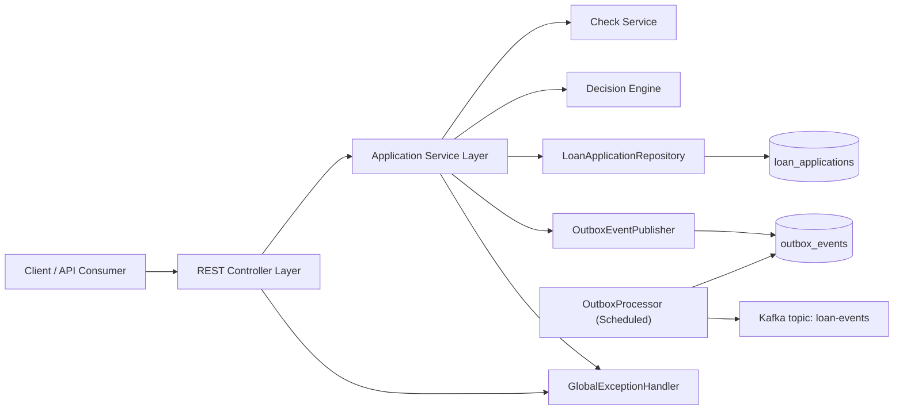

# Loan Origination System Backend


Production-style Spring Boot backend that models a loan origination workflow with underwriting checks, decisioning, and reliable event delivery via the outbox pattern.

Update `daddyb17/loan-origination-system.git` in the CI badge URL after pushing to GitHub.

## Why This Project Stands Out

- End-to-end business workflow from submission to underwriting decision
- Strong validation and clear API error contracts
- Explicit lifecycle transition rules to prevent invalid state changes
- Transactional outbox for reliable asynchronous Kafka publishing
- Retry + dead-letter behavior for failed event delivery
- Correlation IDs in logs and responses for traceability
- Automated test coverage and CI pipeline

## Architecture



## Tech Stack

- Java 21
- Spring Boot 3 (Web, Validation, Data JPA, Kafka)
- H2 (local profile)
- MapStruct, Lombok
- JUnit 5, Mockito, Spring Test, JaCoCo
- GitHub Actions CI
- Docker + Docker Compose

## API Surface

Base path: `/api`

- `POST /loan-applications`
- `GET /loan-applications/{applicationId}`
- `GET /loan-applications?userId={id}&status={status}&page=0&size=20`
- `GET /loan-applications/user/{userId}`
- `GET /loan-applications/status/{status}`
- `PUT /loan-applications/{applicationId}/status`
- `POST /loan-applications/{applicationId}/process`
- `DELETE /loan-applications/{applicationId}`

Detailed cURL examples: [docs/api-examples.md](docs/api-examples.md)

## Run Locally

```bash
./gradlew bootRun
```

- App: `http://localhost:8080/api`
- H2 Console: `http://localhost:8080/api/h2-console`

## Run With Docker

```bash
docker compose up --build
```

This starts the API service and Kafka (KRaft mode).

## Run Tests

```bash
./gradlew clean test jacocoTestReport
```

Coverage report:

- `build/reports/jacoco/test/html/index.html`

## Profiles

- `local` (default): in-memory H2, H2 console enabled, schema auto-update
- `prod`: external datasource via env vars, stricter JPA config (`ddl-auto=validate`)

## Key Environment Variables

- `SERVER_PORT`
- `KAFKA_BOOTSTRAP_SERVERS`
- `KAFKA_TOPIC_LOAN_EVENTS`
- `OUTBOX_MAX_RETRIES`
- `OUTBOX_PROCESSOR_DELAY_MS`
- `OUTBOX_PUBLISH_TIMEOUT_SECONDS`
- `DB_URL`
- `DB_USERNAME`
- `DB_PASSWORD`
- `DB_DRIVER`

## Portfolio Talking Points

- Demonstrates event-driven reliability pattern used in production systems
- Shows practical domain modeling with state machine-style transitions
- Includes API quality concerns beyond CRUD (validation, traceability, paging)
- Ships with test automation and CI for engineering maturity


